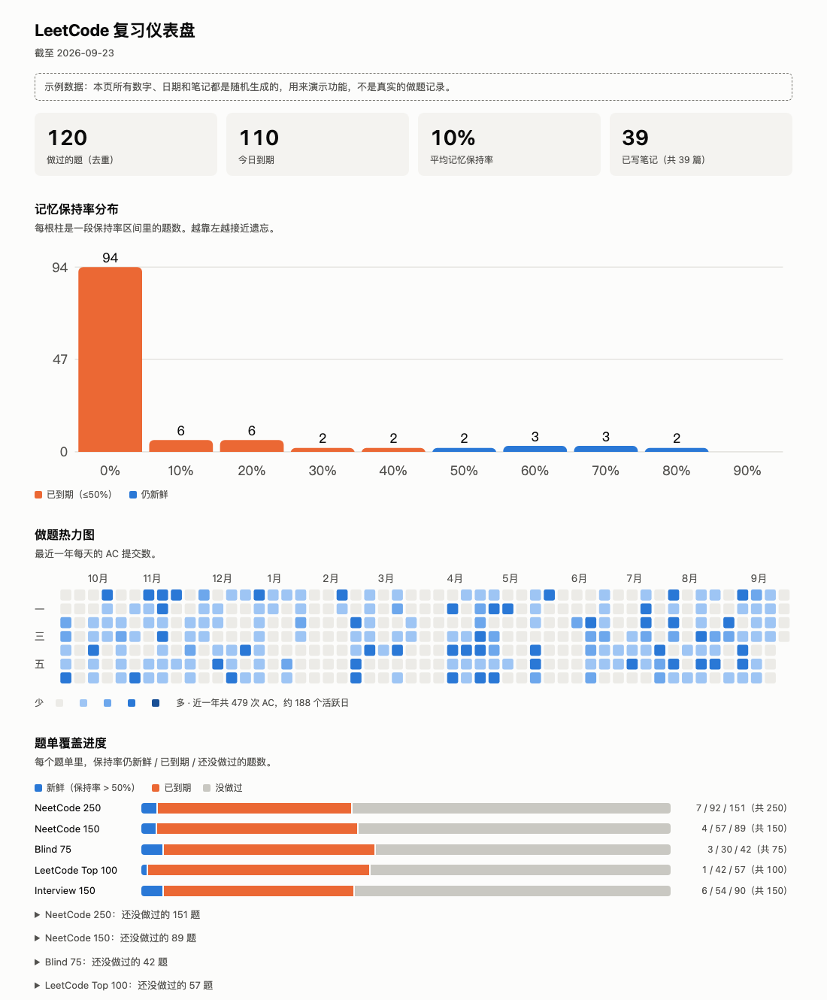

# leetcode-toolkit

**Stop re-solving problems you remember. Redo the ones you've forgotten.**

leetcode-toolkit reads your full LeetCode submission history and uses a spaced-repetition (memory curve) model to rank the problems most worth redoing today. Problems that keep showing up in interview lists — NeetCode 250, Top 100, Top Interview 150, Google, Apple — are pushed up the queue. Results can be synced to Notion, and there is a dashboard to browse them.

[](https://leetcode-review.netlify.app/)

<sub>The screenshot and the [live demo](https://leetcode-review.netlify.app/) are rendered from randomly generated sample data, not a real submission history.</sub>

## Features

- **Full history, not the last 20.** Pulls every submission through LeetCode's GraphQL API with your own session cookie. (The public `alfa-leetcode-api` only exposes the latest ~20 submissions and cannot paginate, which is not enough for a memory model.)
- **Forgetting-curve ranking.** Each problem gets a review interval that grows every time you solve it again, adjusted for difficulty and for how often it appears in well-known lists.
- **Interview-list aware.** NeetCode 250 / 150, Blind 75, LeetCode Top 100, Top Interview 150, and company lists (Premium).
- **Notion sync.** Upserts the queue into a Notion database and links your existing notes to the matching problems.
- **Dashboard.** Review queue, retention distribution, per-problem forgetting curve, activity heatmap and list coverage, as one local HTML file.
- **Extras.** Claude-generated hints for a problem (hints first, not full solutions) and today's daily challenge.

## Quick start

```bash
git clone https://github.com/jingpeng7527/leetcode-toolkit.git
cd leetcode-toolkit
pip3 install -r requirements.txt
cp .env.example .env      # then fill in LEETCODE_SESSION and LEETCODE_CSRFTOKEN
python3 scripts/review.py
```

**Getting your cookies:** log in to leetcode.com → browser DevTools → Application → Cookies → `leetcode.com`, and copy the values of `LEETCODE_SESSION` and `csrftoken` into `.env`. They are equivalent to your login: never share them or commit them (`.env` is git-ignored).

You should see a table like this. The column headers are in Chinese; the rows below are made up for illustration:

```
                    今日复习推荐（共 N 题，显示前 30）
 题目                        难度    分数  上次AC      AC次数  超期(天)  所在题单
 two-sum                     Easy    -     2025-01-12  2       310.5     N250 N150 B75 T100 I150 Google
 coin-change                 Medium  -     2025-06-03  1       120.8     N250 N150 T100 I150 Apple
 word-ladder                 Hard    -     2025-09-30  1       35.2      N250 I150 Google
```

## Commands

| Command | What it does |
|---|---|
| `python3 scripts/review.py` | Print today's review queue (`--all` includes problems not yet due, `--limit N`, `--export out.csv`) |
| `python3 scripts/dashboard.py` | Build `dashboard.html` from your real history and open it (`--no-open` to skip opening) |
| `python3 scripts/dashboard.py --demo` | Build `docs/index.html` from random sample data; needs no cookie and is safe to publish |
| `python3 scripts/sync.py` | Sync the top 50 problems to Notion (`--limit N`, `--all`) |
| `python3 scripts/explain.py two-sum` | Layered hints from Claude for a problem (`--language python`) |
| `python3 scripts/daily.py` | Print today's daily challenge |
| `python3 -m pytest tests` | Run the unit tests |

## How the ranking works

A problem is **due** once more than one review interval has passed since your last accepted submission.

1. **Base interval** grows with every time you solve the problem: 1, 3, 7, 16, 35, 75, 160 days (×1.5 for each solve after that).
2. **Difficulty scales the interval.** With a [zerotrac](https://zerotrac.github.io/leetcode_problem_rating/) contest rating the factor is `clamp(1.3 − (rating − 1200) / 2000, 0.6, 1.3)`, so harder problems come back sooner. Problems rated above 2000 are the exception and are pushed back (×1.5), since they are rarely worth a daily slot. Without a rating: Easy 1.3, Medium 1.0, Hard 0.7.
3. **List membership shortens it.** `interval / (1 + 0.1 × hits)`, where `hits` is the number of lists (NeetCode 250, Top 100, Google, …) containing the problem.
4. **Retention** halves every interval: `0.5 ^ (days since last AC / interval)`. Due means retention ≤ 50%.
5. **Ranking** is `forget probability × (1 + 0.25 × hits)`. Long-forgotten problems all sit near 1, so among those the ones that appear in more lists come first.

Example: a Medium problem you solved twice, without a rating, that appears in 3 lists has an interval of `3 days × 1.0 / 1.3 ≈ 2.3 days`. Six days after your last solve, it is well overdue and ranks high.

Every constant lives at the top of [review/spaced_repetition.py](review/spaced_repetition.py).

## Configuration

Copy `.env.example` to `.env` and fill in what you need.

| Variable | Required for | Notes |
|---|---|---|
| `LEETCODE_SESSION`, `LEETCODE_CSRFTOKEN` | review, dashboard, sync | See [Quick start](#quick-start) |
| `COMPANIES` | company lists | Comma separated, default `google,apple`. Needs cookies from a **LeetCode Premium** account; lists that can't be fetched are skipped with a warning |
| `NOTION_API_KEY`, `NOTION_DATABASE_ID` | Notion sync | See below |
| `NOTION_NOTES_PAGE_ID` | linking existing notes | Optional |
| `ANTHROPIC_API_KEY` | `explain.py` | Optional |

### Notion

Create a database with these properties (names and types must match exactly) and share it with your Notion integration:

| Property | Type |
|---|---|
| `Name` | Title |
| `Slug` | Text |
| `Difficulty` | Select |
| `Rating`, `AC Count`, `Overdue Days` | Number |
| `Last AC` | Date |
| `Lists` | Multi-select |
| `URL` | URL |

`sync.py` upserts by `Slug`, so re-running updates rows instead of duplicating them.

**Linking your existing notes (optional).** Add `Notes` (URL) and `Topic` (Select) properties, set `NOTION_NOTES_PAGE_ID` to the root page of your notes, and share that page with the integration (••• → Connections). The sync scans its child pages, including pages one level down and inside toggles, and reads the problem number from a page title such as `76. Minimum Window Substring` or `滑动窗口 - 3. Longest Substring…`. Matching rows get the page link in `Notes` and the parent page's name in `Topic`. Problems you have notes for are synced even when they fall outside the top N.

## Dashboard

`scripts/dashboard.py` writes a single self-contained HTML file: no server and no build step. The version generated from your real history is `dashboard.html`, which is git-ignored because it contains your submission history.

To publish a public demo, use `--demo`. It builds the same page from randomly generated records (problems sampled from public lists with random dates, counts and notes) and shows a notice saying so. It never touches your account. The output goes to `docs/index.html`, which any static host can serve; the live demo above is that folder deployed as-is.

## Project layout

```
api/            LeetCode GraphQL client, list and rating loaders, small JSON cache
review/         scoring model (spaced_repetition.py, pure and unit-tested) and the fetch pipeline
integrations/   Notion upsert, Notion notes crawler, Claude explainer
scripts/        command-line entry points and the dashboard template
data/           NeetCode 250 slug list
docs/           the generated demo page and its screenshot
tests/
```

## Limitations and troubleshooting

- **leetcode.com only.** leetcode.cn is not supported.
- **Undocumented API.** Submission history comes from a GraphQL endpoint LeetCode does not document, so it can change without notice.
- **Ratings are partial.** zerotrac ratings exist only for problems that appeared in contests (about 2,600); the rest fall back to Easy / Medium / Hard.
- **NeetCode 250 is a snapshot** in `data/neetcode250.json`, extracted from neetcode.io's site data. Re-extract it if the list changes.
- **Auth error?** Your cookies expired. Copy fresh ones into `.env`.
- **A company list is empty or skipped?** The account behind the cookies is probably not Premium.
- **Notion says a property doesn't exist?** Property names must match the table above exactly, including `Notes` and `Topic` when notes linking is on.

## Credits

Contest ratings by [zerotrac/leetcode_problem_rating](https://github.com/zerotrac/leetcode_problem_rating). NeetCode 150 and Blind 75 flags from [neetcode-gh/leetcode](https://github.com/neetcode-gh/leetcode).

## License

MIT
